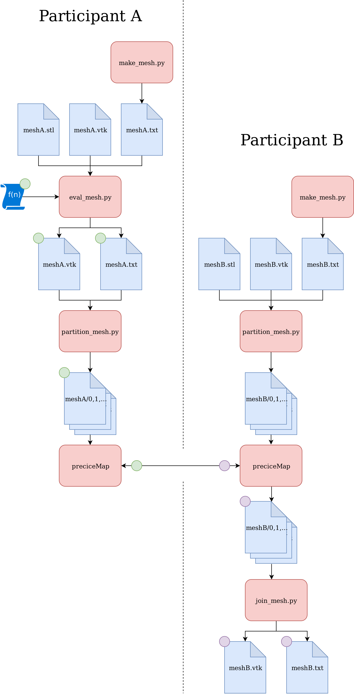

# aste
aste stands for Artificial Solver Testing Environment for preCICE.
aste facilitates getting data into preCICE and out of it. An overview is given by the following figure:


aste consists of compiled C++ Modules and of Python modules.
## Python modules
### eval_mesh.py
Reads a mesh as either `.vtk` or `.txt` and evaluates a function given by `-f` on it. The function gets the mesh points a numpy array of the form `x = [[x_1, y_1, z_1], ...]` and should store the result in `y`.
### partition_mesh.py
Reads a mesh as either `.vtk` or `.txt`, partitions it and stores the parts in a directory like `dirname/0, 1, ...`. 
For partitioning two algorithms are available. The meshfree algorithm does not need any mesh topology information, 
whereas the topological algorithm needs topology information. 
This python module needs the C++ module `libmetisAPI.so` if the topological algorithm is used.
### join_mesh.py
Reads a partitioned mesh from a directory like `dirname/0, 1, ...` and saves it to a single file.
### libMetisAPI
This is a small C++ wrapper around METIS. It is only required if `partition_mesh.py` should use a topological algorithm. 
### preciceMap
This is a C++ Module, which does the coupling through precice. It expects a mesh in the format given by `partition_mesh.py`.

## Dependencies
### C++ modules
##### Required
- preCICE
- Eigen3
- MPI
- CMake
##### Optional
- METIS
### Python modules
##### Required
- NumPy
##### Optional
- vtk (Visualization Toolkit)
- scipy
## Building
Make sure to have all the needed dependencies installed. Then do:
```
mkdir build
cd build
cmake ..
make
```
If precice is not installed in `$PRECICE_ROOT/build` do `cmake -DCMAKE_LIBRARY_PATH=$PRECICE_INSTALL_DIR ..` with the correct installation directory.
## Demo
A demonstration of aste can be run with `./demo.sh`. A bunny-shaped mesh is mapped onto a red blood cell. The result can be seen in `result.vtk`. 
